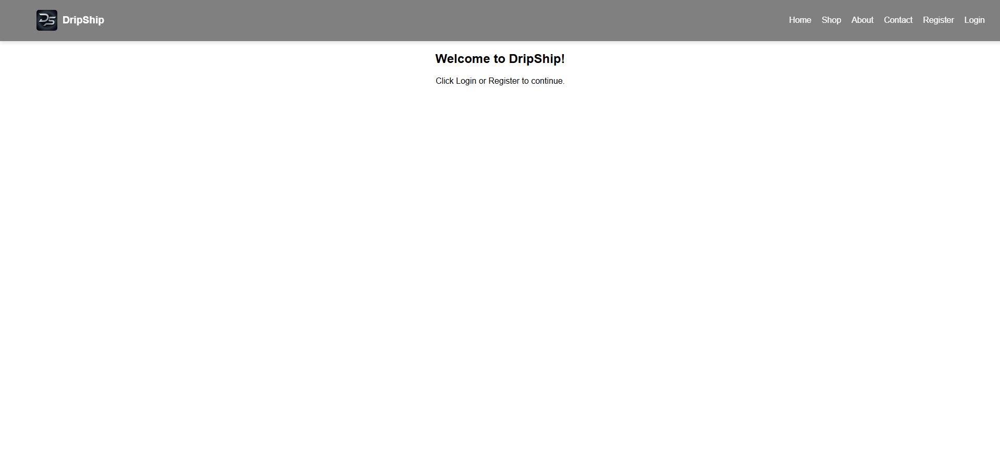
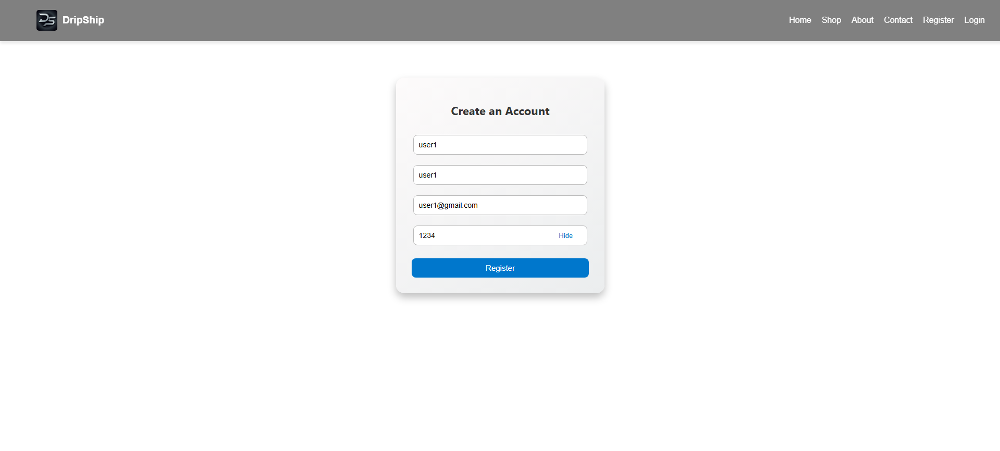
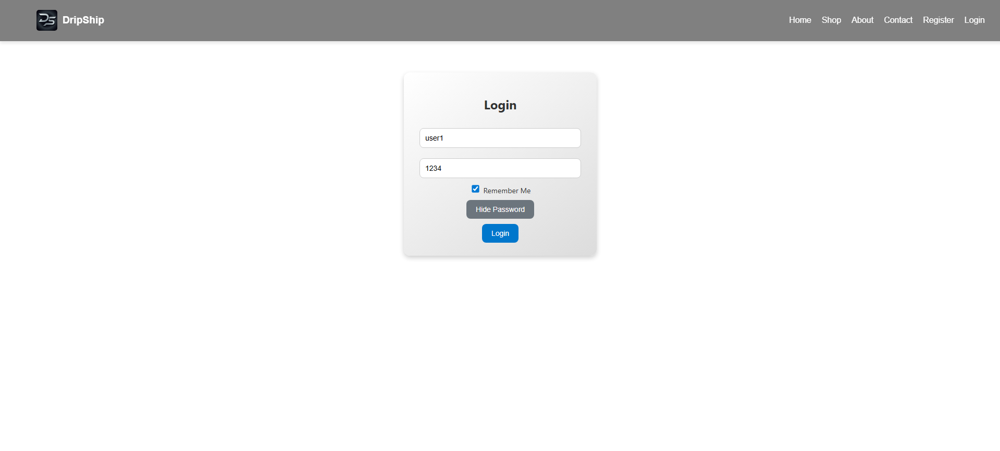
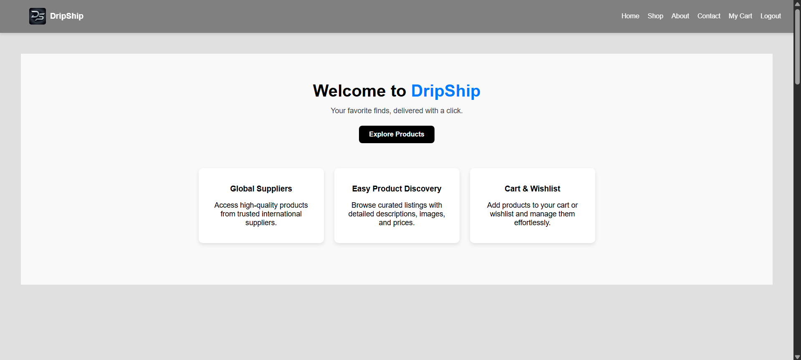
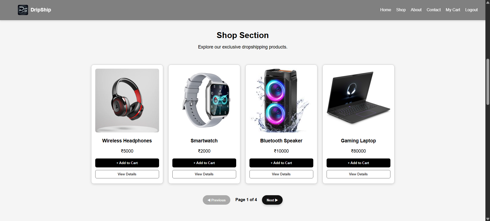
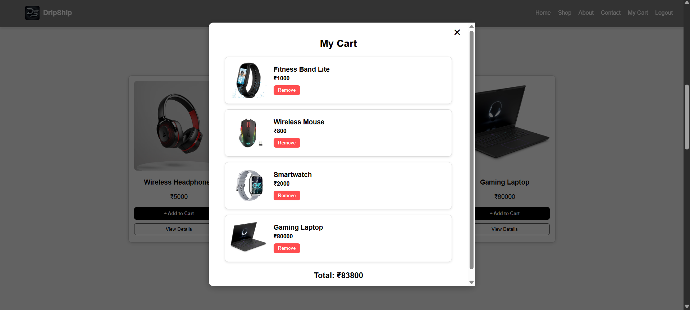
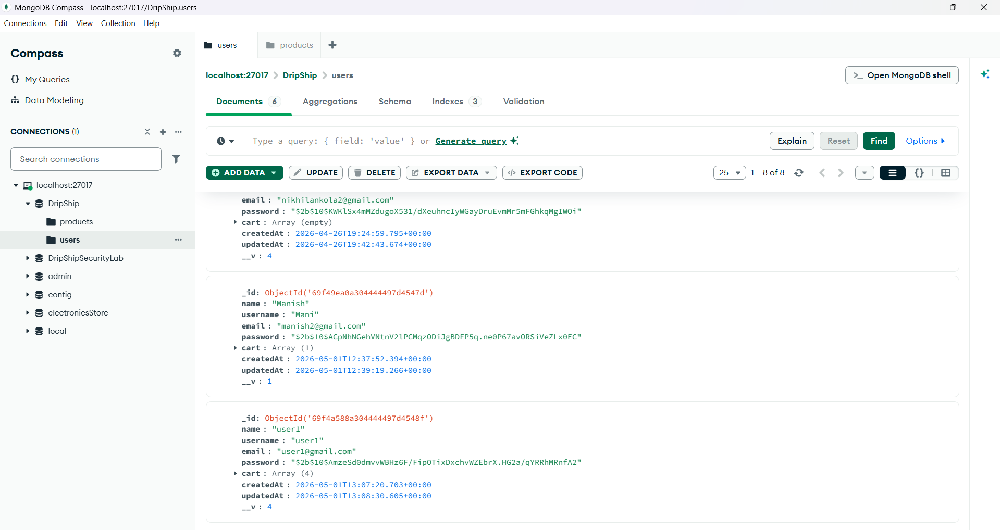
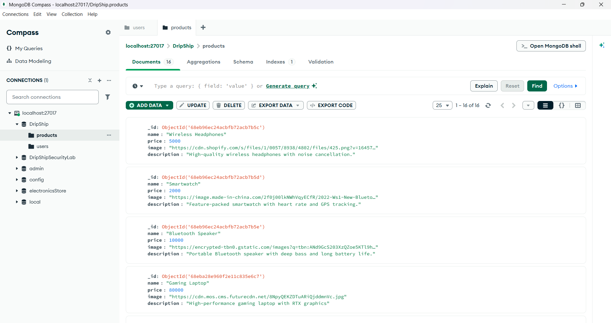
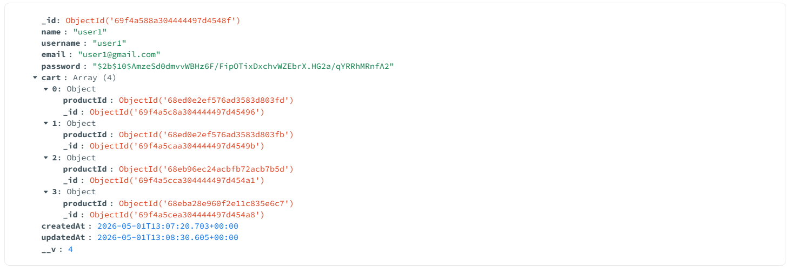

# DripShip

DripShip is a MERN Stack based e-commerce web application built using MongoDB, Express.js, React.js, and Node.js.

The project focuses on core online shopping functionalities such as user authentication, product browsing, cart management, protected user actions, and MongoDB-based product storage.

It was developed as a solo academic micro-project to demonstrate full-stack MERN development concepts including frontend-backend integration, REST API development, JWT authentication, secure password handling, and responsive UI design.

The name "DripShip" represents the concept of a modern online shopping platform with scalable e-commerce architecture and smooth user experience..

---

## Project Overview

DripShip allows users to:

- Register and create an account
- Login securely using JWT Authentication
- Browse products dynamically from MongoDB
- View product details
- Add products to cart
- Remove products from cart
- View total cart price
- Use Remember Me functionality
- Use Show/Hide Password functionality
- Experience login attempt limiting after multiple failed attempts
- Navigate through animated product gallery with pagination

The project provides a strong foundation for a scalable e-commerce platform where users can securely browse products, manage carts, and interact with a full-stack shopping system built on MERN architecture.

---

## Tech Stack

### Frontend

- React.js
- JavaScript
- CSS
- Framer Motion (for animations)

### Backend

- Node.js
- Express.js

### Database

- MongoDB (Localhost using MongoDB Compass)

### Authentication & Security

- JWT (JSON Web Token)
- bcrypt.js (Password Hashing)

### API Testing / Development

- REST APIs using Express Routes

---

## Key Features

### User Authentication

- Secure user registration
- Password hashing using bcrypt
- JWT-based login authentication
- Protected routes using middleware
- Remember Me functionality using localStorage
- Show/Hide Password toggle
- Login attempt limiter (locks after 3 failed attempts)

---

### Product Management

- Dynamic product fetching from MongoDB
- Product cards with image, price, and description
- Product detail toggle
- Smooth pagination for product browsing
- Framer Motion based UI animations

---

### Cart System

- Add to Cart functionality
- Prevent duplicate cart additions
- Protected cart access using JWT verification
- Remove from Cart functionality
- Dynamic total price calculation
- Cart popup overlay UI

---

## Project Structure

```bash
DripShip/
│
├── backend/
│   ├── middleware/
│   │   └── verifyToken.js
│   │
│   ├── models/
│   │   ├── Product.js
│   │   └── User.js
│   │
│   ├── routes/
│   │   ├── cartRoutes.js
│   │   ├── productRoutes.js
│   │   └── userRoutes.js
│   │
│   ├── .env
│   ├── package.json
│   └── server.js
│
├── public/
│
├── screenshots/
│
├── src/
│   ├── images/
│   ├── App.css
│   ├── App.js
│   ├── Cart.js
│   ├── Gallery.js
│   ├── Home.js
│   ├── index.css
│   ├── index.js
│   ├── Login.css
│   ├── Login.js
│   ├── Register.css
│   └── Register.js
│
├── package.json
└── README.md
```

--- 

## Screenshots
### Landing Page
Welcome page before login/register


### Registration Page
User registration form with password visibility toggle


### Login Page
JWT login system with Remember Me and login attempt limiter


### Home Page
Hero section with animated feature cards


### Product Gallery
Product listing with Add to Cart, View Details, and Pagination


### Cart Popup
Dynamic cart overlay with total price and remove option


### MongoDB Collections
- Users Collection
    

- Products Collection
    

- Cart items stored inside User document
    

---

## MongoDB Database Design

### User Schema
```javascript
{
  name,
  username,
  email,
  password,
  cart: [
    {
      productId
    }
  ]
}
```

### Product Schema
```javascript
{
  name,
  price,
  image,
  description
}
```

--- 

## Installation & Setup

### Step 1: Clone the Repository
```bash
git clone https://github.com/NikhilAnkola/DripShip.git
cd DripShip
```

### Step 2: Install Frontend Dependencies
```bash
npm install
```

### Step 3: Install Backend Dependencies
``` bash
cd backend
npm install
```

### Step 4: Create .env File

Inside the `backend` folder, create a `.env` file:

```env
JWT_SECRET=your_secret_key
MONGO_URI=mongodb://localhost:27017/DripShip
```

### Step 5: Start Frontend
```bash
npm start
```

Frontend runs on:
```bash
http://localhost:3000
```

### Step 6: Start Backend

Open a new terminal:
```bash
cd backend
node server.js
```

Backend runs on:
```bash
http://localhost:5000
```

---

## API Routes

### User Routes
```bash
POST   /api/users/register
POST   /api/users/login
GET    /api/users
```

### Product Routes
```bash
GET    /api/products
GET    /api/products/:id
```

### Cart Routes
```bash
POST   /api/cart/add
GET    /api/cart
DELETE /api/cart/remove/:
```

---

## Current Limitations

The current version focuses on core e-commerce functionality and does not yet include advanced production-level features such as:

- Payment Gateway Integration
- Admin Dashboard
- Order Tracking
- Product Quantity Management
- Checkout System
- Wishlist Backend Logic
- Product Search & Filters
- Inventory Management
- Full Production Deployment

This project is designed as a strong MERN full-stack academic project and serves as a solid foundation for future feature expansion.

---

## Future Improvements

Possible future upgrades:

- Razorpay / Stripe Payment Integration
- Admin Dashboard
- Product Quantity System
- Order History & Tracking
- Wishlist Backend
- Supplier-side Dropshipping Integration
- Automated Order Processing
- Inventory Management
- Product Search & Filters
- Full Production Deployment

--- 

## Learning Outcomes

Through this project, I learned:

- MERN stack architecture
- REST API development
- JWT Authentication
- Password hashing using bcrypt
- Protected routes using middleware
- MongoDB schema design
- React state management
- Frontend + Backend integration
- LocalStorage usage
- Real-world debugging and deployment structure

---

## Author
### Nikhil Ankola

B.Tech Information Technology
3rd Year Undergraduate Student

Built as a solo MERN stack academic micro-project.

GitHub: https://github.com/NikhilAnkola

---

## Final Note

DripShip is designed as a practical MERN Stack e-commerce project that demonstrates real-world full-stack development concepts including authentication, protected routes, MongoDB integration, cart management, and responsive frontend design.

Rather than overcomplicating the system with unnecessary features, the project focuses on building strong core functionality with clean backend architecture and user-friendly frontend interaction.

It serves as a solid demonstration of full-stack development skills and provides a strong base for future enhancements such as payments, admin controls, and advanced e-commerce workflows.